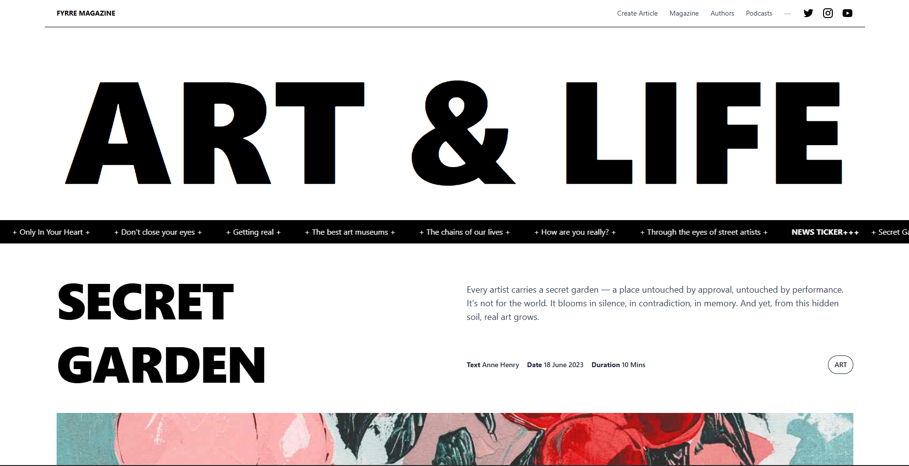

# 🐾 FyrreMagazine

A modern, community-driven online magazine for creative souls — featuring curated articles, original podcasts, beloved authors, and more. Built with **React**, **Firebase**, and **EmailJS**, FurryMagazine is designed to be dynamic, responsive, and content-rich.

---

## Link of the deployed website

https://furrymagazine.netlify.app

## 🌟 Features

- 📰 **Articles Section** — Filterable magazine-style articles with rich visuals.
- 🎙️ **Podcasts** — Browse and listen to podcast episodes, each with its own page.
- 👤 **Authors** — Discover the creators behind the content.
- ✍️ **Create Article** — Admin interface for adding new articles.
- 📬 **Newsletter** — Automatically send new articles to subscribers via EmailJS.
- 📱 **Responsive** — Tailored for mobile, tablet, and desktop screens.
- ⚙️ **Lazy Loading** — Fast and optimized with `React.lazy` and dynamic loading.

---

## 📸 Preview



---

## 🛠️ Tech Stack

| Frontend         | Backend / Services          | Tools & Styling |
| ---------------- | --------------------------- | --------------- |
| React + Vite     | Firebase Firestore          | TailwindCSS     |
| React Router DOM | EmailJS for newsletters     | Heroicons / SVG |
| TypeScript       | Firebase Hosting (optional) | React Toastify  |

---

## 🚀 Getting Started

### 1. Clone the repo

```bash
git clone https://github.com/eugenekravchuk/web_react_project
cd web_react_project
```

### 2. Install dependencies

```bash
npm install
```

### 4. Start dev server

```bash
npm run dev
```

---

## 💅 Style Guide

- Consistent layout with `TailwindCSS`
- Lazy loaded components: `Navbar`, `Header`, `ArticleCard`, etc.
- Mobile-first responsive grids
- Smooth transitions and hover animations

---

## 📄 License

MIT © 2025 FurryMagazine by Lida & Eugene
